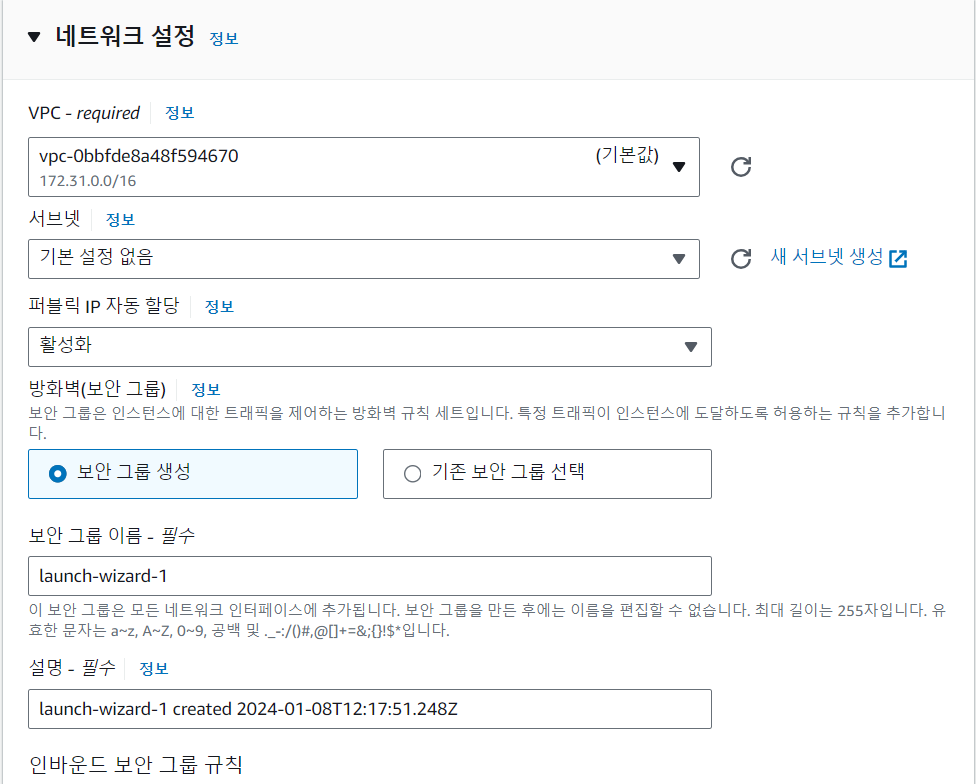
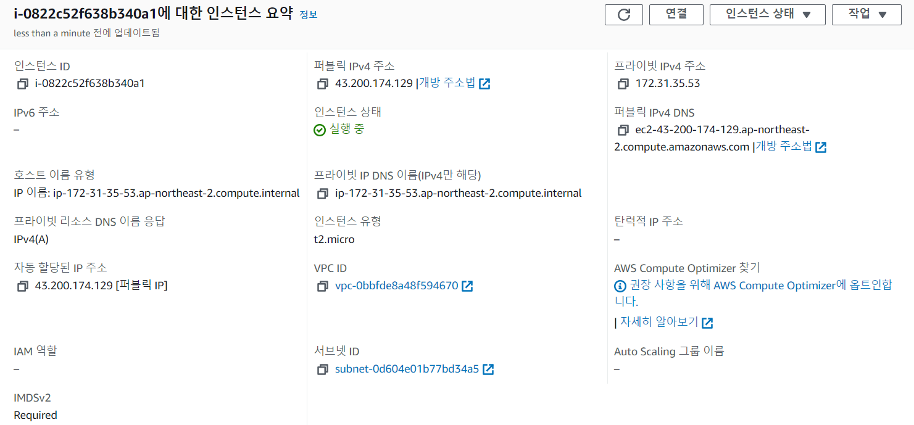
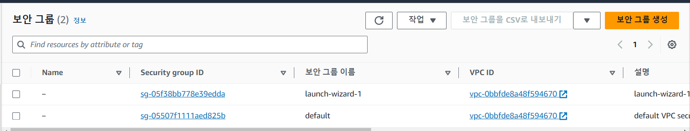
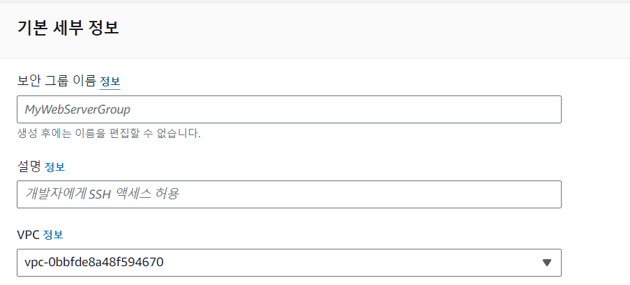

# 214.01.08 ~ 12 기술스택 정리
***
# AWS EC2 생성 후 Spring Boot 띄우기

# 1. EC2 인스턴스 생성

- 계정 생성 후 콘솔에 로그인 된 상태여야 한다.

## 1.1 AWS Region 설정


- 리전을 서울로 설정

## 1.2 EC2 메뉴로 이동


## 1.3 새 인스턴스 생성


- 왼쪽 화면 인스턴스 클릭
- 오른쪽 노랑색 인스턴스 시작 버튼 클릭

## 1.4 Amazon Machine Image(AMI) 및 인스턴스 유형 선택


- 선택사항 (비어있어도 됨)


- 무료 버전인 프리티어 사용
- 어떤 서버를 구성하는지 선택하는 과정


- 프리 티어 무료!

## 1.5 키 페어 생성


- 새 키 페어 생성 클릭


- 키 페어는 EC2 서버에 SSH 접속을 하기 위해 필수
- 생성 후 .pem 파일 다운됨, SSH 환경에 접속하기 위해 해당 키 파일이 존재하는 위치로 가서 ssh 명령어를 실행하면 된다
- 재 다운 불가능 절대 안전한 곳에 저장

## 1.6 네트워크 및 스토리지 선택




- 기본값 사용 작업 환경 달라지면 소스 유형을 위치 무관으로 설정


- 특정 ip에서만 사용할 거면 내ip 추가 하면됨


- 무료 스토리지는 30 Gib 까지
    - **무료 등급 적격 고객은 최대 30GB의 EBS 범용(SSD) 또는 마그네틱 스토리지를 얻을 수 있습니다.**
- 볼륨 유형은 SSD로 선택 해야됨
- Provisioned IOPS SSD(프로비저닝된 IOPS SSD)를 선택한다면 사용하지 않아도 활성화한 기간만큼 비용 발생

## 1.7 인스턴스 설정 요약


- 다 설정하면 우측에 인스턴스 설정한거 요약뜸
- 이상한 부분 없으면 시작 눌러서 생성하면된다.

## 1.8 인스턴스 생성 완료


- 처음 페이지도 올아가면 인스턴스 만들어짐
- 탄력적 IP와 보안그릅 추가하기 위해 인스턴스 ID를 클릭

---

# 2. 탄력적 IP (Elastic IP)

- EC2 인스턴스는 서버를 중지하고 다시 실행하면 퍼블릭 IP가 변경된다
- 때문에 클라이언트가 사용할 수 있는 변하지 않는 IP가 필요
- 탄력적 IP는 외부에서 인스턴스에 접근 가능한 고정 IP이다

## 2.0 퍼블릭 ip는 진짜 변할까?


- 초기에는 54.180.94.150로 설정됨


- 인스턴스 중지



- 인스턴스 시작 하니까 퍼블릭 ip 주소 바뀜 ㄷㄷ
- 인스턴스 중지, 시작은 오른쪽 위 인스턴스 상태에서 관리 가능

## 2.1 탄력적 IP 메뉴 접근


- 왼쪽 메뉴바에 네트워크 및 보안 → 탄력적 IP 선택
- 오른 쪽 위 탄력적 IP 주소 할당 클릭


- 따로 뭐 할것 없음 할당 누르면 된다.

## 2.3 탄력적 IP 주소 선택


- 오른쪽 상단에 작업 → 탄력적 ip 주소 연결

## 2.4 인스턴스 선택 및 연결


- 사용할 인스턴스 선택


- 프라이빗 IP 주소 선택


- 설정 다했으면 연결 클릭

## 2.5 인스턴스 정보 확인


- 탄력적 Ip를 연결하고 다시 인스턴스 정보를 확인하면 IP가 할당된 것을 볼 수 있다
- 퍼블릭 IP 주소도 가존 값에서 탄력적 IP 주소로 자동 변경


- 이거 두개 같으면 됨

---

# 3. SSH 클라이언트로 서버 접속


- 인스턴스 ID 클릭 후 우측 상단에 연결 누르면 가이드라인 나옴


[AWS EC2 보안그룹 인바운드 규칙 접속 설정 ( AWS / EC2 / Linux2 / 보안그룹 / 인바운드 규칙 / Nginx / Jenkins )](https://green-joo.tistory.com/18)

## 3.1 터미널 실행 후 키 페어 파일 위치 이동

- 터미널 실행후 이전에 다운 받은 키페어 파일 위치 이동


- 윈도우에서 우분투 사용시 탐색기로 현재 위치 열기
    - explorer.exe .
    - Zone.Indentifier 은 뭐냐;;

## 3.2 키 파일 권한 병경

- chmod 400 spring-cicd-test.pem
- 권한 변경 명령어(파일 소유자에게만 읽기 권한 부여)

## 3.3 SSH 접속

- 가이드에 있는 대로 퍼블릭 DNS 또는 퍼블릭 IP를 사용해서 인스턴스에 접속
- 퍼블릭 DNS로 접속
    - ssh -i "spring-cicd-test.pem" [ubuntu@ec2-52-79-204-200.ap-northeast-2.compute.amazonaws.com](mailto:ubuntu@ec2-52-79-204-200.ap-northeast-2.compute.amazonaws.com)


## 3.4 호스트 등록해서 간편하게 접속

- ~/.ssh 디렉터리로 키 페어 파일 복사
    - cp spring-cicd-test.pem ~/.ssh/
- 키 페어 파일 권한 변경
    - chmod 600 spring-cicd-test.pem
    - 소유자가 읽고 쓰기 가능


- ~/.ssh/config 파일 생성
    - ~/.ssh/ 디렉터리에 config 파일 생성
    - 이미 파일이 존재하면 맨 아래 입력
    - vi ~/.ssh/config

  

- 설정한 Host 이름으로 접속
    - 키페어 파일이 없는 곳에서도 간단한 별칭으로 SSH 접속가능
    - ssh mykeyhost

  


## EC2 접속 종료

- exit로 접속 종료하고 로컬 환경으로 돌아옴
- 인스턴스 중단 상태가 아님 중단은 따로 해줘야됨

---

# 4 보안 그룹 설정

- 보안 그룹은 AWS에서 제공하는 방화벽 모음이다
- 서비스를 제공하는 애플리케이션이라면 상관없지만 RDS처럼 외부에서 함부로 접근하면 안되는 인스턴스는 허용된 IP에서만 접근하도록 설정이 필요
    - 인바운드 : 외부 → EC2 인스턴스 내부 허용
    - 아웃 바운드 : EC2 인스턴스 내부 → 외부 허용

## 4.1 현재 보안 그룹 확인


- 인스턴스 정보의 보안 탭에서 보안 그룹 확인 가능
- 인바운드 규칙에 22번 포트의 모든 IP에 대해서 TCP 연결을 허용한다는 내용 확인 가능

## 4.2 보안 그룹 ID 리스트 확인




## 4.3 보안 그룹 생성



- 보안그룹 이름과 설명 작성


- 인바운드 규칙은 아무것도 없어 외부에서 접근 불가능
- 아웃바운드는 기본적으로 모든 트래픽에 대해 열려있다

## 4.4 인바운드 규칙


- 인바운드 외부에서 EC2 로 요청할 때 허용할 IP 대역을 설정할 수 있다
- 유형을 먼저 선택하면 자동으로 맞는 프로토콜과 포트 범위가 고정
- 로컬 PC에서 서버에 접속할 수 있게 SSH를 추가하고 소스를 내 IP로 추가


- 여러 환경에서 작업 할거라 일단 열어둠

## 4.5 아웃 바운드 규칙

- 딱히 필요없음으로 모든 트래픽 그대로 둔다.

## 4.6 인스턴스에서 보안 그룹 변경


- 다시 인스턴스 ID로 돌아가서 작업 → 보안 → 보안 그룹 변경 클릭


- 방금 만든 보안그룹 추가 후 기존 보안그룹은 제거


- 제대로 변경됨

---

# 5. EC2 인스턴스에 도커, 도커 컴포즈 설치

## 5.1 패키지 업데이트

- sudo apt update

## 5.2 https관련 패키지 설치

- sudo apt install apt-transport-https ca-certificates curl software-properties-common

## 5.3 도커 레포 접근을 위한 gpg 키 설정

- GPG키?
    - 리눅스 패키지 관리 툴이 이 프로그램 패키지가 유효한지 확인하기 위해 설치 전 gpg키로 검증을 거친다
- curl -fsSL [https://download.docker.com/linux/ubuntu/gpg](https://download.docker.com/linux/ubuntu/gpg) | sudo apt-key add -

## 5.4 도커 레포 등록

- sudo add-apt-repository "deb [arch=amd64] [https://download.docker.com/linux/ubuntu](https://download.docker.com/linux/ubuntu) focal stable"

## 5.5 다시 업데이트

- sudo apt update

## 5.6 도커 설치

- sudo apt install docker-ce

## 5.7 버전 확인

- docker —version

## 5.8 도커 컴포즈 설치

```bash
sudo curl -L https://github.com/docker/compose/releases/latest/download/docker-compose-$(uname -s)-$(uname -m) -o /usr/local/bin/docker-compose
```

## 5.9 도커 컴포즈 실행권한 주기

- `sudo chmod +x /usr/local/bin/docker-compose`

## 5.10 버전 확인

- `docker-compose --version`

---

# 6. EC2 환경 설정

## 6.1 인스턴스 서버 설정 최신화

- sudo apt-get update
    - 우분트 패키지 리스트 최신 상태로 업데이트
- sudo apt-get -y upgrade
    - 시스템의 모든 패키지를 최신 버전으로 업그레이드 -y는 자동으로 yes를 응답하는 옵션
- sudo apt-get install -y git
    - git 설치 명령어
- sudo apt-get install -y nginx
    - nginx 설치 명령어

## 6.2 gitlab-runner 설치 및 등록

- **`curl -L https:*//packages.gitlab.com/install/repositories/runner/gitlab-runner/script.deb.sh | sudo bash*`**
    - gitlab runner의 공식 저장소를 시스템에 추가하는 스키립트 다운로드
- **`sudo apt-get install -y gitlab-runner`**
    - gitlab runner 패키지 설치

## 6.3 ec2 인스턴스에서 gitlab runner 연결 해제

- gitlab-runner unregister --url <OLD_GITLAB_SERVER_URL> --token <OLD_RUNNER_TOKEN>
- gitlab-runner unregister --url [https://lab.ssafy.com/wjs6265/cicdtest.git](https://lab.ssafy.com/wjs6265/cicdtest.git) --token 3T4A1rbjUqjGGEPtNymp