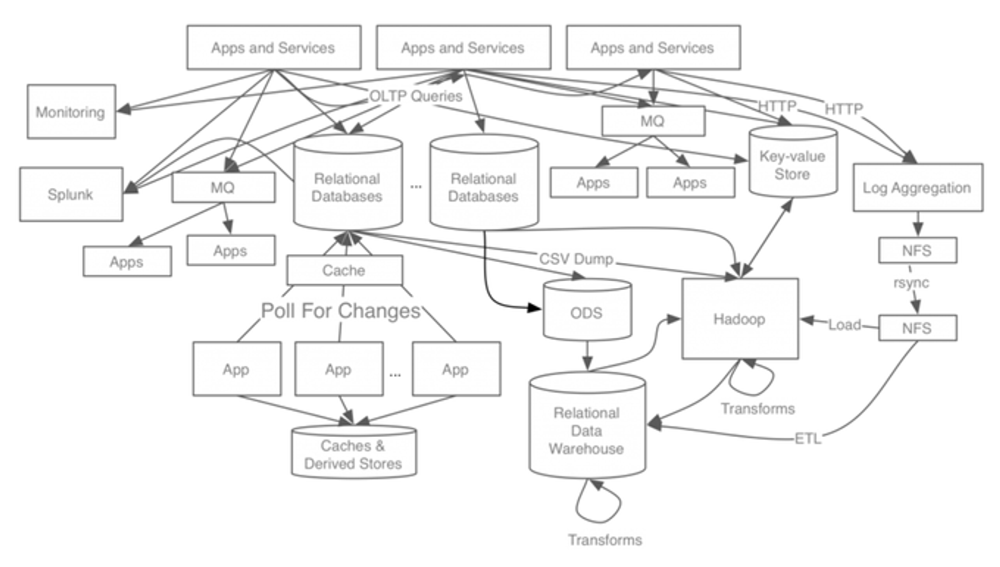
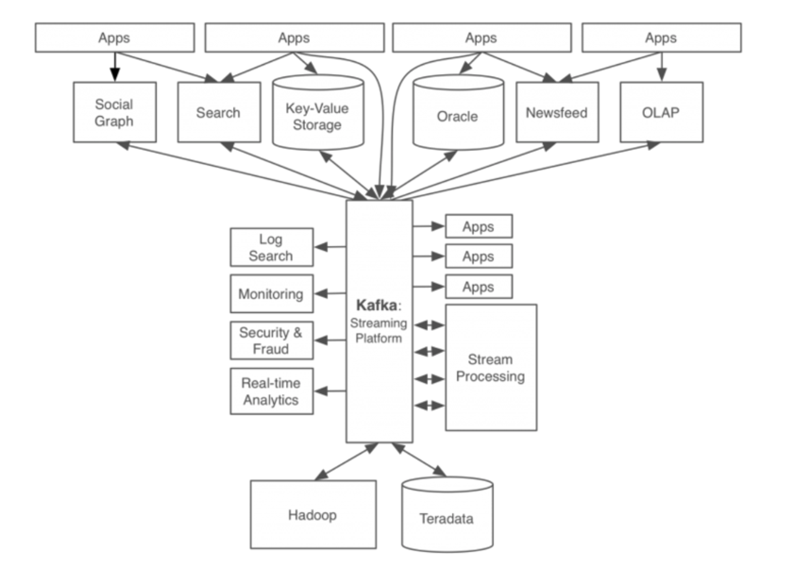
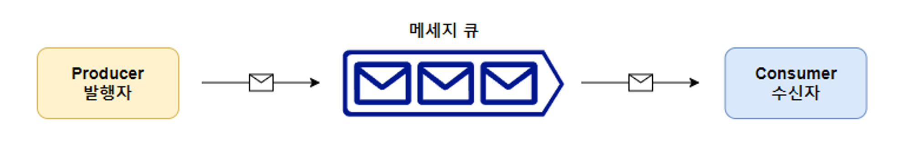
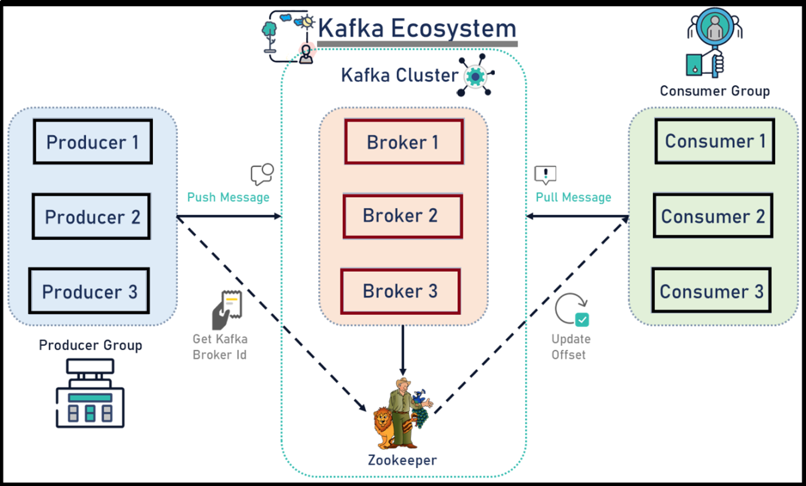
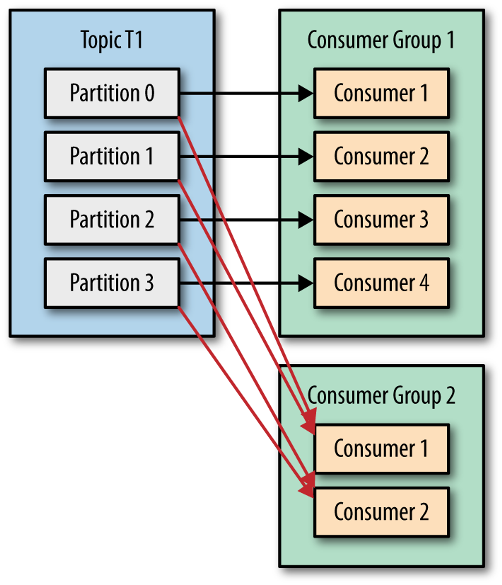
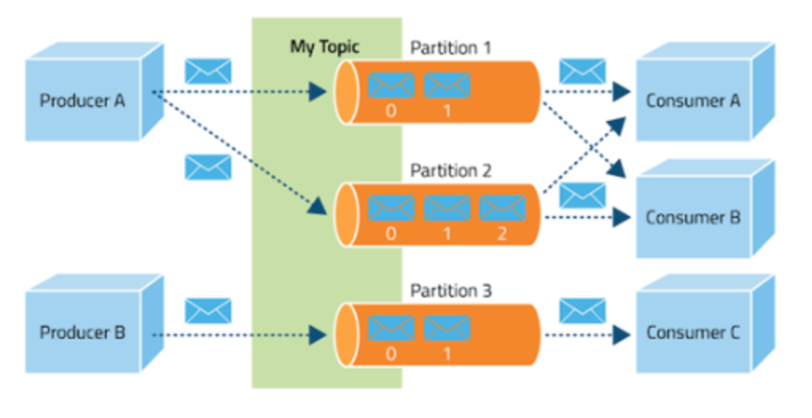

# 24.01.08 ~ 12 기술스택 정리
## 01.08 JPA - Querydsl
### 🚀 동적 쿼리 작성방법
- 동적 쿼리를 해결하는 두 가지 방식
#### BoolenanBuilder 사용
```java
@Test
    public void dynamicQuery_BooleanBuilder () throws Exception {
        String usernameParam = "member1";
//        Integer ageParam = 10;
        Integer ageParam = null;

        List<Member> result = searchMember1(usernameParam, ageParam);
        assertThat(result.size()).isEqualTo(1);
    }

    private List<Member> searchMember1(String usernameCond, Integer ageCond) {

        BooleanBuilder builder = new BooleanBuilder();
        // 생성자에 인자값으로 초기값 설정 가능
//        BooleanBuilder builder = new BooleanBuilder(member.username.eq(usernameCond));
        
        if (usernameCond != null) {
            builder.and(member.username.eq(usernameCond));
        }

        if (ageCond != null) {
            builder.and(member.age.eq(ageCond));
        }

        return queryFactory
                .selectFrom(member)
                .where(builder)
                .fetch();
    }

```
- BooleanBuilder를 통해 원하는 query 조건문을 and 또는 or 연산을 추가 후 <span style='background-color: #ffff00; color:black'>**queryfactory의 where에서 생성한 builder**</span>을 사용한다.

#### Where 다중 파라미터 사용
```java
@Test
public void 동적쿼리_WhereParam() throws Exception {
    String usernameParam = "member1";
    Integer ageParam = 10;
    List<Member> result = searchMember2(usernameParam, ageParam);
    Assertions.assertThat(result.size()).isEqualTo(1);
}
private List<Member> searchMember2(String usernameCond, Integer ageCond) {
    return queryFactory
            .selectFrom(member)
            .where(usernameEq(usernameCond), ageEq(ageCond))
            .fetch();
}
private BooleanExpression usernameEq(String usernameCond) {
     return usernameCond != null ? member.username.eq(usernameCond) : null;
}
private BooleanExpression ageEq(Integer ageCond) {
    return ageCond != null ? member.age.eq(ageCond) : null;
}
```
- `where`조건에 null 값은 무시됨
- 메서드를 다른 쿼리에서도 <span style='background-color:#ffff00; color:black;'>**재활용**</span> 할 수 있음
- 쿼리 자체의 가독성이 높아진다.

#### 조건으로 만든 메서드 조합
```java
private BooleanExpression allEq(String usernameCond, Integer ageCond) {
	 return usernameEq(usernameCond).and(ageEq(ageCond));
}
```
- `null`체크는 주의해서 처리


### 🚀 수정, 삭제 벌크 연산
#### 쿼리 한 번으로 대량 데이터 수정
```java
long count = queryFactory
 .update(member)
 .set(member.username, "비회원")
 .where(member.age.lt(28))
 .execute();
```

#### 기존 숫자에 1 더하기
```java
long count = queryFactory
 .update(member)
 .set(member.age, member.age.add(1))
 .execute();

// 곱하기
// update member  set age = age + 1
```

#### 쿼리 한 번으로 대량 데이터 삭제
```java
long count = queryFactory
 .delete(member)
 .where(member.age.gt(18))
 .execute();
```
⚠ 영속성 컨텍스트에 있는 엔티티를 무시하고 실행되기때문에 해당 쿼리를 실행 후 ***영속성 컨텍스트를 초기화*** 하는 것이 안전
```java
EntityManager em = new EntityManager();
...
em.flush();
em.clear();
```

### :rocket: SQL Function 호출
- SQL function은 JPA와 같이 **Dialect에 등록된 내용만 호출**할 수 있다.
- member → M으로 변경하는 replace함수 예시
    
    ```java
    String result = queryFactory
        .select(Expressions.stringTemplate("function('replace', {0}, {1}, {2})", 
            member.username, "member", "M"))
        .from(member)
        .fetchFirst();
    ```
    
- 소문자 변경 예시
    
    ```java
    .select(member.username)
    .from(member)
    .where(member.username.eq(Expressions.stringTemplate("function('lower', {0})", 
    member.username)))
    ```
    
    - lower 같은 ansi 표준 함수들은 querydsl이 상당부분 내장하고 있다. 따라서 다음과 같이 처리해도 결과는 같다.
    
    ```java
    .where(member.username.eq(member.username.lower()))
    ```

---

## 01.09 JUnit5
### 🚀 단위 테스트?

<aside>
💡 프로그래밍에서 소스 코드의 특정 모듈이 의도된 대로 정확히 검증하는 절차
</aside>

- 모든 함수와 메소드에 대한 테스트 케이스를 작성하는 절차
- 이를 통해, 코드변경으로 인해 문제가 발생할 경우 단시간 내에 이를 파악하고 바로 잡을 수 있도록 해줌
  
### 📌 JUnit5
<aside>
💡 이전 버전과 다르게, 3개의 서브 프로젝트로 이루어짐
`JUnit Platform` + `Junit Jupiter` + `JUnit Vintage`

</aside>

- `JUnit Platform` : 테스트를 발견하고, 계획을 생성하는 `TestEngine` 인터페이스를 가지고 있음
→ 이를 이용해 테스트 발견, 실행, 결과 보고
    - `JVM`에서 테스트 프레임워크를 실행하는데 기초를 제공
- `JUnit Jupiter` : `TestEngine`의 실제 구현체는 별도 모듈이며, 그 중 하나가 `Jupiter-Engine`임
→ 이 모듈은 `Jupiter-API`를 사용해 작성한 테스트 코드를 발견하고 실행함
→ `Jupiter API`는 `JUnit5`에 새롭게 추가된 테스트 코드용 `API`로서 개발자는 이를 이용해 테스트 코드 작성이 가능
    - `JUnit5`에서 테스트를 작성하고 확장을 하기 위한 **새로운 프로그래밍 모델과 확장 모델의 조합**
- `JUnit Vintage`
    - 하위 호환성을 위해 `JUnit3`과 `JUnit4`를 기반으로 돌아가는 플랫폼에 **테스트 엔진을 제공**

### 📌 JUnit5 설정 방법

- `SpringBoot` 2.2버전 이상부터는 기본으로 의존이 추가되어 따로 설정 할 필요가 없음
- `SpringBoot` 프로젝트가 아닌 경우 의존성 추가 ⇒ [mvn repo](https://mvnrepository.com/artifact/org.junit.jupiter/junit-jupiter-engine)
    
    ```xml
    <dependency>
        <groupId>org.junit.jupiter</groupId>
        <artifactId>junit-jupiter-engine</artifactId>
        <version>5.9.1</version>
        <scope>test</scope>
    </dependency>
    ```
    
    ```groovy
    test {
        useJUnitPlatform()
    }
    
    dependencies {
        testImplementation 'org.junit.jupiter:junit-jupiter-api:5.8.1'
        testRuntimeOnly 'org.junit.jupiter:junit-jupiter-engine:5.8.1'
    }
    ```

### 📌 Annotation
#### `@DisplayName`
- 테스트 클래스나 테스트 메소드에 이름을 붙여줄 때 사용
- `@DisplayName("회원가입")`
- 공백이나 특수문자, 이모지 등 사용 가능
- 기본적으로 테스트 이름은 메소드 이름을 따라감

#### `@DisplayNameGeneration`

- 클래스에 해당 어노테이션을 붙이면 `@Test`메소드 이름에 언더바로 표시한 모든 부분은 공백으로 처리
- 속성
    - `Standard` : 메소드 이름과 그 뒤에 붙는 괄호 그대로 보여줌
    - `Simple` : 메소드 이름만 보여줌
    - `ReplaceUnderscores` : 언더스코어 제거
    ex) 회원_조회 → 회원 조회
    - `IndicativeSentences` : 테스트 클래스 이름과 테스트 메소드 이름 + 괄호를 보여줌

#### `@BeforeEach`

- 각각 테스트 메소드가 실행되기전에 실행되어야 하는 메소드 명시
    - `@Test`, `@RepeatedTest`, `@ParameterizedTest` , `@TestFactory`가 붙은 테스트 메소드를 실행하기 전 실행
- 주로 테스트전에 필요한 **목업 데이터를 세팅**하기 위해 주로 사용

#### `@AfterEach`

- `@Test`, `@RepeatedTest`, `@ParameterizedTest` , `@TestFactory`가 붙은 메소드가 실행 된 후 실행됨

#### `@BeforeAll`

- 테스트가 시작되기 전 딱 1번만 실행
→ `@BeforeEach`는 각 메소드마다 실행되는것에 있어 차이가 있음

#### `@AfterAll`

- 테스트가 끝난 후 딱 1번만 실행
- `@AfterEach`와 차이는 각 메소드마다 실행되는 차이가 있음

#### `@Nested`

- Test 클래스 안에 Nested 테스트 클래스를 작성할 때 사용됨
`static`이 아닌 중첩 클래스 → 즉, **Inner 클래스**여야 함
- 테스트 인스턴스 라이플 사이클이 `per-class`로 설정되어 있지 않다면
`@BeforeAll`, `@AfterAll`가 동작하지 않음

#### `@Tag`

- 테스트를 필터링할 때 사용
→ 클래스 또는 메소드 레벨에 사용

#### `@Disabled`

- 테스트 클래스나, 메소드의 테스트를 비활성화함 (`JUnit4`의 `@Ignore`와 같음)

#### `@Timeout`

- 주어진 시간안에 테스트가 끝나지 않으면 실패

#### `@ExtendWith`

- extension을 등록, 해당 어노테이션은 상속이 안됨

#### `@RegisterExtension`

- 필드를 통해 extension을 등록
→ private이 아니라면 상속됨

#### `@TempDir`

- 필드 주입이나 파라미터 주입을 통해 임시적인 디렉토리를 제공할 때 사용

## 📌 AssertJ 메소드
### `AssertJ` 기본 검증 메소드

| 메소드 | 설명 |
| --- | --- |
| isEqualTo(값) | 검증대상과 동일한 값인지 비교 |
|  isSameAs(값) | 검증대상과 값을 ==비교 |
| isNotNull() | 검증대상이 Not Null인지 확인 |
| isNull() | 검증대상이 Null인지 확인 |
| isNotEmpty() | 검증대상이 Not Empty 인지 확인 |
| isEmpty() | 검증대상이 Empty인지 확인 |
| isIn() | 검증대상이 값 목록에 포함되어 있는지 검증 |
| isNotIn() | 검증대상이 값 목록에 포함되어 있지 않는지 검증 |

### `AssertJ` 문자열 검증 메소드

| 메소드 | 설명 |
| --- | --- |
| contains(값) | 검증대상에 (값)이 포함되어있는지 확인 |
| containsOnlyOnce(값) | 검증대상에 (값)이 딱 한 번만 포함되어 있는지 확인 |
| containsOnlyDigits() | 숫자만 포함하는지 검증 |
| containsWhitespaces() | 공백 문자를 포함하고 있지 않은지 검증 |
| containsOnlyWhitespaces() | 공백 문자만 포함하고 있지 않은지 검증 |
| doesNotContainPattern(패턴) | 검증대상의 정규 표현식에 일치하는 문자를 포함하고 있지 않은지 검증 |
| startsWith(값) | 검증대상의 시작 값이 (값)과 동일한지 비교 |
| endsWith(값) | 검증대상의 마지막 값이 (값)과 동일한지 비교 |
| doesNotStartWith(값) | 검증대상의 (값)이 지정한 문자열로 시작하지 않는지를 검증 |
| doesNotEndWith(값) | 검증대상의 (값)이 지정한 문자열로 끝나지 않는지를 검증 |

### `AssertJ` 숫자 검증 메소드

| 메소드 | 설명 |
| --- | --- |
| isPositive() | 검증대상이 양수인지 확인 |
| isNotPositive() | 검증대상이 양수가 아닌지 확인 |
| isNegative() | 검증대상이 음수인지 확인 |
| isZero() | 검증대상이 0인지 확인 |
| isNotZero() | 검증대상이 0이 아닌지 확인 |
| isOne() | 검증대상이 1인지 확인 |
| isGraterThan(값) | 검증대상이 값을 초과했는지 확인 |
| isLessThan(값) | 검증대상이 값보다 미만인지 확인 |
| isGraterThanOrEqualTo(값) | 검증대상이 값 이상인지 확인 |
| isLessThanOrEqualTo(값) | 검증대상이 값 이하인지 확인 |
| isBetween(값1, 값2) | 값1과 값2 사이에 포함되는지 확인 |

### `AssertJ` 날짜 검증 메소드

| 메소드 | 설명 |
| --- | --- |
| isBefore(비교 값) | 비교 값 보다 이전인지 검증 |
| isBeforeOrEqualTo(비교 값) | 비교 값 보다 이전이거나 같은지 검증 |
| isAfter(비교 값) | 비교 값 보다 이후인지 검증 |
| isAfterOrEqualTo(비교 값) | 비교 값 보다 이후이거나 같은지 검증 |

---
## 01.10 생성 패턴
### 📌 Builder 패턴
- 복잡한 객체들을 단계별로 생성할 수 있음
- 많은 필드를 초기화 해야하는 복잡한 객체에 적합
- 클래스에서 객체 생성 코드를 빼서 Builder 클래스로 만듦
- 다양한 종류의 빌더를 만들어 다른 방식으로 객체를 생성할 수 있음

```java
public class Member {
    private String id;
    private String name;
    private String email;
    private String password;

    public static class Builder {
        private String id;
        private String name;
        private String email;
        private String password;

        public Builder() {}

        public Builder id(String id) {
            this.id = id;
            return this;
        }

        public Builder name(String name) {
            this.name = name;
            return this;
        }

        public Builder email(String email) {
            this.email = email;
            return this;
        }

        public Builder password(String password) {
            this.password = password;
            return this;
        }

        public Member build() {
            return new Member(this);
        }
    }

    private Member(Builder builder) {
        this.id = builder.id;
        this.name = builder.name;
        this.email = builder.email;
        this.password = builder.password;
    }
}

// ########################## 사용 예시 ########################
Member member = new Member.Builder()
										.id("myID")
										.name("myName")
										.email("myEmail@example.com")
										.password("myPassword")
										.build();
```

### 📌 Factory 메소드 패턴
- 객체 생성에 관련된 부분을 서브 클래스에게 위임

> 구성요소
> 
1. `Creator` : 팩토리 메소드를 정의하는 클래스. 이 클래스의 객체가 `Product` 객체를 반환
2. `ConcreteCreator` : `Creator` 클래스를 상속받아 팩토리 메소드를 구현하는 클래스
이 클래스의 팩토리 메소드에서는 `ConcreteProduct`객체를 생성하여 반환
3. `Product` : `Creator` 클래스에 의해 반환되는 객체의 인터페이스를 정의하는 클래스

> 예시
> 

```java
// Animal 클래스
public abstract class Animal {
    public abstract String makeSound();
}

// Animal을 상속받은 Dog 클래스와 Cat 클래스
public class Dog extends Animal {
    @Override
    public String makeSound() {
        return "Bark";
    }
}

public class Cat extends Animal {
    @Override
    public String makeSound() {
        return "Meow";
    }
}

// Factory 클래스
public class AnimalFactory {
    public Animal createAnimal(String type) {
        if (type.equals("Dog")) {
            return new Dog();
        } else if (type.equals("Cat")) {
            return new Cat();
        }
        return null;
    }
}

// main 
public class Main {
    public static void main(String[] args) {
        AnimalFactory animalFactory = new AnimalFactory();
        
        Animal dog = animalFactory.createAnimal("Dog");
        System.out.println(dog.makeSound());  // 출력: Bark
        
        Animal cat = animalFactory.createAnimal("Cat");
        System.out.println(cat.makeSound());  // 출력: Meow
    }
}
```

> 팩토리 메소드 패턴 사용 이유
> 
1. 캡슐화 : 사용자가 **객체 생성에 필요한 구체적인 클래스를 알 필요 없음**
2. 코드 중복 최소화 : 팩토리 메소드에서 객체 생성 코드를 관리하므로, **객체를 생성하는 코드가 중복되는 것을 방지** 할 수 있음
3. 확장성 : 팩토리 메소드 패턴을 사용하면, 새로운 타입의 객체를 생성해야 할 경우 팩토리 메소드만 수정하면 됨
→ **코드의 수정을 최소화, 시스템의 유연성과 확장성을 높임**
4. 의존성 역전 : 고수준의 모듈이 저수준의 모듈에 의존하는 것이 아니라, 두 모듈 모두 추상화에 의존
→ **시스템의 결합도를 낮추고 유지보수성을 높임**

### 📌 추상 팩토리 패턴
- 관련된 객체의 집합을 생성하기 위한 인터페이스 제공
→ 구체적인 클래스를 명시 X, 관련성이 있는 객체들을 생성하기 위한 대체 방법 제공

> 구성요소
> 
1. `AbstractFactory` : 객체 생성에 필요한 메소드를 선언하는 인터페이스
2. `ConcreteFactory` : 추상 팩토리에 선언된 메소드를 구현하는 클래스
3. `AbstractProduct` : 제품에 대한 추상 인터페이스
4. `ConcreteProduct` : 추상 제품 인터페이스를 구현하는 클래스

> 예시
> 

```java
// 추상 클래스
public interface Animal {
    String getAnimal();
    String makeSound();
}

public interface Food {
    String getFoodName();
}

// 구현 클래스
public class Dog implements Animal {
    @Override
    public String getAnimal() {
        return "Dog";
    }

    @Override
    public String makeSound() {
        return "Bark";
    }
}

public class Cat implements Animal {
    @Override
    public String getAnimal() {
        return "Cat";
    }

    @Override
    public String makeSound() {
        return "Meow";
    }
}

public class Bread implements Food {
    @Override
    public String getFoodName() {
        return "Bread";
    }
}

public class Fruit implements Food {
    @Override
    public String getFoodName() {
        return "Fruit";
    }
}

// 추상 팩토리
public interface AnimalFactory {
    Animal createAnimal();
}

public interface FoodFactory {
    Food createFood();
}

// 팩토리 클래스
public class DogFactory implements AnimalFactory {
    @Override
    public Animal createAnimal() {
        return new Dog();
    }
}

public class CatFactory implements AnimalFactory {
    @Override
    public Animal createAnimal() {
        return new Cat();
    }
}

public class BreadFactory implements FoodFactory {
    @Override
    public Food createFood() {
        return new Bread();
    }
}

public class FruitFactory implements FoodFactory {
    @Override
    public Food createFood() {
        return new Fruit();
    }
}

// Main
public class Main {
    public static void main(String[] args) {
        AnimalFactory dogFactory = new DogFactory();
        Animal dog = dogFactory.createAnimal();
        System.out.println(dog.getAnimal());  // 출력: Dog
        System.out.println(dog.makeSound());  // 출력: Bark

        FoodFactory breadFactory = new BreadFactory();
        Food bread = breadFactory.createFood();
        System.out.println(bread.getFoodName());  // 출력: Bread
    }
}
```
---
## 01.12 Kafka
## 📌 Kafka

<aside>
💡 대규모 실시간 데이터 스트리밍을 처리하는 데 사용되는 **분산 이벤트 스트리밍 플랫폼**

#분산 이벤트 스트리밍?
- 분산 이벤트 : 여러 대의 서버(노드)에 분산되어 **저장된 이벤트(데이터)**
- 이벤트 스트리밍 : **대량의 이벤트(데이터)**를 실시간으로 처리하는 방식

</aside>

### 아키텍처




- 카프카 적용 전
    - 데이터 저장소들이 도착지점까지 모든 시스템을 거치는 **End-To-End** 연결로 매우 복잡
- 카프카 적용 후
    - **모든 이벤트와 데이터를 카프가가 처리**
- 분산 이벤트 실시간으로 관리하는 방법?
⇒ **Pub / Sub 모델의 메세지 큐 형태로 동작**

## 📌 메세지 큐 (Message Queue, MQ)

<aside>
💡 #메세지 큐
- **메시지 지향 미들웨어**(MOM : 서로 다른 시스템, 애플리케이션, 서비스 간 메시지를 교환하는 방식)를 구현한 시스템

</aside>



메시지 큐를 사용하면 **발신자와 수신자가 서로를 직접 알지 못해도 송수신이 가능**(비동기 : 느슨한 결합)
→ 발행자와 수신자 사이에 **메시지 큐가 이를 중개**하기 때문

> 장점
> 
- 수신자의 서비스에서 장애가 발생해도 발행자로 인해 **발행된 메세지는 이미 메시지 큐에 남아 있기 때문에 수신자에게 메세지 전달 보장**가능
- 발행자, 수신자가 서로 의존하지 않고 독립적이기에 확장하는데 문제가 없음
- **메세지 큐라는 중개소**가 있기때문에 발행자, 수신자가 **서로의 요청과 응답을 기다리지 않고 큐에 담아 비동기로 통신**할 수 있음

> `Point to Point` & `Pub / Sub`
> 
- 메세지 큐
    - Point to Point (`P2P`) 
    : 한 명의 발행자의 메세지는 한 명의 컨슈머에 의해 소비되는 방식
    → 즉, **1:1 메시지 전송 방식** (채팅?)
    - Publish/Subscribe (`Pub / Sub`)
    : 발행자가 특정 Topic에 메세지를 보내면, 해당 **Topic을 구독한 여러 수신자가 해당 메세지를 받는 방식** (알림?)

|  | P2P | Pub / Sub | 둘 다 지원 |
| --- | --- | --- | --- |
| 서비스 | - Amazon SQS | - Amazon SNS
- Kafka
- Redis | - ActiveMQ
- RabbitMQ |

## 📌 용어 정리


### 카프카 클러스터 (Kafka cluster)

- 브로커들의 모임으로 확장성과 고가용성을 위해 브로커들이 클러스터로 구성되어 있음

### 브로커 (Broker)

- 각각의 Kafka 서버를 말함
프로듀서로부터 메세지를 전달받아 토픽에 저장하고 컨슈머에 저장
(하나의 브로커는 여러개의 토픽을 가질 수 있음)

### 주키퍼 (zookeeper)

- Kafka 클러스터 상태와 정보 등을 관리하는 역할을 함
(Kafka를 실행 시키기 위해선 Zookeeper도 같이 실행해야함)

### 프로듀서 (Producer)

- 메세지를 발행하는 주체.
메세지 발행 시 특정 토픽을 정하여 발행함

### 컨슈머 (Consumer)

- 메세지를 소비, 수신하는 주체
특정 토픽을 구독하여 메세지를 전달 받음



### 컨슈머 그룹

- 하나 이상의 컨슈머가 모여 구성된 그룹
- 같은 컨슈머 그룹 내에서는 각 파티션에 대한 메세지 처리가 한 컨슈머에게만 할당됨 (각 파티션의 메세지는 한 번만 처리)
- ex) ‘책’ 이라는 토픽에 파티션 1,2가 있고 그룹 G에 컨슈머 a,b가 있다면 a는 1, b는 2 파티션에서 메세지를 받는 것
즉, 한 그룹안에 있는 여러 컨슈머들이 서로 다른 파티션에서 동일한 토픽을 동시에 소비하는 것.



### 토픽

- 메세지를 구분하는 단위로 프로듀서로부터 전송된 데이터는 토픽이름으로 구별

### 파티션

- 하나의 토픽은 하나 이상의 파티션으로 나눠짐
즉, 동일한 토픽이 여러 파티션에 나눠서 저장되는 것

### 오프셋

- 파티션 내에서 메세지의 위치를 나타냄
→ 오프셋 값을 알면 해당 메세지로 바로 접근할 수 있음

---

## 📌 Pub / Sub 모델 별 차이

|  | Kafka | RabbitMQ | Redis Pub / Sub |
| --- | --- | --- | --- |
| 데이터 유지 | 디스크에 데이터를 지속적으로 저장하며 TTL(Time-To-Live) 설정으로 오래된 데이터를 삭제할 수 있다.
또한 Consumer가 어디까지 메세지를 읽었는지 추적 가능 | 메세지는 메모리와 디스크에 저장도리 수 있으며 기본적으로 메세지는 Consumer가 처리하면 삭제됨 | 기본적으로 메모리 기반의 스토리지 데이터 유실 위험이 있다.
영속성을 위해선 AOP, RDB 추가 설정이 필요 |
| 확장성 | Topic의 Partition을 통해 확장성을 제공, 분산처리가 가능 | Queue를 통해 확장성을 제공하지만 Kafka 만큼의 높은 병렬처리 능력은 부족 | Pub/Sub 모델에서는 병렬 처리나 분산 처리 방식이 제한적 |
| 우선 순위 | 변경 불가능하지만 한 파티션 내에서는 시간 순서를 보장 | priority queue를 지원해 우선순위에 따라 처리 가능 | - |
| 장점 | - 이벤트가 전달되어도 삭제되지 않고 디스크에 저장된다.
- 고성능, 고가용성, 분산처리에 효과적
- producer 중심적으로 많은 양의 데이터를 병렬 처리 가능 | - Direct, Fanout, Topic, Headers의 라우팅 옵션을 제공하여 유연한 라우팅이 가능
- Manage UI가 기본 제공
- Broker 중심적인 형태로 publisher와 consumer간의 보장되는 메세지 전달
- 플러그인도 제공되어 확장성이 뛰어남 | 인메모리로 빈번하고 속도가 중요한 작업에 유리 |
| 단점 | 범용 메세지 시스템에서 제공되는 다양한 기능이 제공되지 않는다. | - Kafka보다 느림
- 대용량 데이터 처리에 상대적으로 부적합 | 이벤트 도착을 보장하지 못함 |
| 사용사례 | 대용량 실시간 스트림 데이터 처리 및 분석에 적합 | 데이터 처리보단, 관리적 측면이나 다양한 기능 구현을 위한 서비스를 구축할 때 사용 | 캐싱, 세션 관리 등 인메모리 스토어가 필요하거나 경량의 실시간 Pub / Sub 시스템에 사용 |