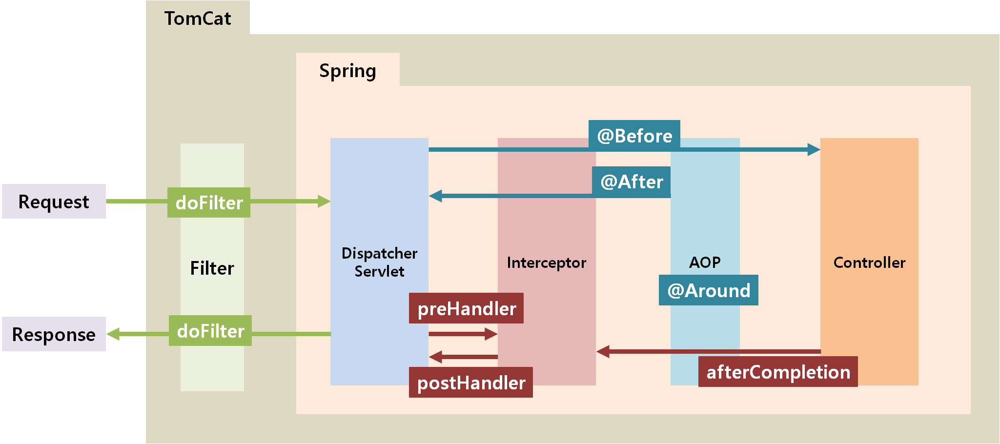

# Back-End 학습 일지

<details>
<summary>01/08(월) Filter & Interceptor</summary>
<div markdown="1">


    
### Filter
    
- Dispatcher Servlet에 요청이 전달되기 전 / 후에 url 패턴에 맞는 모든 요청에 대해 부가 작업을 처리할 수 있는 기능 제공
- 스프링 컨테이너가 아닌 웹 컨테이너에 의해 관리
- Request 및 Response 조작 가능
- Spring과 무관한 전역적인 작업 처리
- 올바른 요청이 아닐 경우 차단하여 Spring Container까지의 전달을 차단해 안정성을 더욱 높일 수 있음
- init(): 필터 객체를 초기화하고 서비스에 추가하기 위한 메소드
- doFilter(): HTTP 요청이 디스패처 서블릿으로 전달되기 전에 웹 컨테이너에 의해 실행되는 메소드
- destroy(): 필터 객체를 서비스에서 제거하고 사용하는 자원을 반환하기 위한 메소드
    
### Interceptor
    
- Dispatcher Servlet이 Controller를 호출하기 전 / 후에 인터셉터가 요청과 응답을 참조하거나 가공할 수 있는 기능을 제공
- Spring Context에서 동작
- Request 및 Response 조작 불가능
- 웹 어플리케이션에 전반적으로 사용되는 기능 처리
- preHandle(): Controller가 호출되기 전에 실행
- postHandle(): Controller가 호출된 후에 실행
- afterCompletion(): 모든 작업이 완료된 후에 실행
- 타입이 일정하지 않고 호출 패턴도 정해쳐 있지 않기 때문에 AOP를 적용하려면 부가 작업 필요함 


</div>
</details>

<details>
<summary>01/09(화) Spring Security 개요</summary>
<div markdown="1">

### Spring Security
- 인증 (Authentication),인가(Authorization) 부여 및 보호 기능을 제공하는 프레임워크
  - Credential 기반 인증 방식: principal을 아이디로, credential을 비밀번호로 함
  - 인증: 해당 사용자가 본인이 맞는지를 확인하는 절차
  - 인가: 인증된 사용자가 요청된 자원에 접근 가능한 가를 결정하는 절차
  - 인증 / 인가를 Filter 흐름에 따라 처리
    
- 
  1. 사용자 정보(id, password)로 로그인(인증) 요청
  2. AuthenticationFilter가 ‘1’의 요청을 가로채고 그 정보를 통해 UsernamePasswordAuthenticationToken의 인증용 객체를 생성
  3. AuthenticationManager의 구현체인 ProviderManager에게 ‘2’에서 생산된 객체를 전달
  4. AutenticationManger는 등록된 AuthenticationProvider을 조회하며 인증을 요구
  5. 실제 데이터베이스에서 사용자 인증정보를 가져오는 UserDetailsService에 사용자 정보를 넘겨줌
  6. 넘겨받은 사용자 정보를 통해 데이터베이스에서 찾아낸 사용자 정보인 UserDetails 객체를 만듦
  7. AuthenticaitonProvider은 UserDetails를 넘겨받고 사용자 정보를 비교
  8. 인증이 완료되면 권한 등의 사용자 정보를 담은 Authentication 객체를 반환
  9. AuthenticationFilter에 Authentication 객체가 반환
  10. Authentication 객체를 Security Context에 저장 (전통적인 세선-쿠키 기반의 인증 방식을 사용)
    
### Authentication
- 현재 접근하는 주체의 정보와 권한을 담는 인터페이스
- Authentication 객체는 SecurityContext에 저장됨
- SecurityContextHolder → SecurityContext → Authentication 접근
    
```java
  public interface Authentication extends Principal, Serializable {
      // 현재 사용자의 권한 목록을 가져옴
      Collection<? extends GrantedAuthority> getAuthorities();
    
      // credential을 가져옴
      Object getCredentials();
    
      Object getDetails();
    
      // Principal 객체 가져옴
      Object getPrincipal();
    
      // 인증 여부 가져옴
      boolean isAuthenticated();
    
      // 인증 여부 설정함
      void setAuthenticated(boolean isAuthenticated) throws IllegalArgumentException;
  }
```
    
### UsernamePasswordAuthenticationToken
- Authentication을 implements한 AbstractAuthenticationToken의 하위 클래스
- 첫 번째 생성자는 인증 전의 객체를 생성하고, 두번째는 인증이 완료된 객체를 생성
    
```java
  public abstract class AbstractAuthenticationToken implements Authentication, CredentialsContainer {
  }
  public class UsernamePasswordAuthenticationToken extends AbstractAuthenticationToken {
      private static final long serialVersionUID = SpringSecurityCoreVersion.SERIAL_VERSION_UID;
        
          // 주로 사용자의 ID에 해당
      private final Object principal;
    
      // 주로 사용자의 PW에 해당
      private Object credentials;
    
      // 인증 완료 전의 객체 생성
      public UsernamePasswordAuthenticationToken(Object principal, Object credentials) {
          super(null);
          this.principal = principal;
          this.credentials = credentials;
          setAuthenticated(false);
      }
    
      // 인증 완료 후의 객체 생성
      public UsernamePasswordAuthenticationToken(Object principal, Object credentials, Collection<? extends GrantedAuthority> authorities) {
          super(authorities);
          this.principal = principal;
          this.credentials = credentials;
          super.setAuthenticated(true); // must use super, as we override
      }
  }
```
    
### **AuthenticationManager** 
- 인증에 대한 부분을 처리
- 실질적으로는 AuthenticationProvider에 의해 처리
- 인증에 성공하면 두번째 생성자를 이용해 객체를 생성하여 SecurityContext에 저장
    
```java
  public interface AuthenticationManager {
    
      Authentication authenticate(Authentication authentication) throws AuthenticationException;
  }
```
    
### AuthenticationProvider 
- 실제 인증에 대한 부분 처리
- 인증 전의 Authentication 객체를 받아서 인증이 완료된 객체를 반환
    
```java
  public interface AuthenticationProvider {
        
      Authentication authenticate(Authentication authentication) throws AuthenticationException;
        
      boolean supports(Class<?> authentication);
  }
```
    
### ProviderManager 
- AuthenticationProvider을 구성하는 목록을 가짐
    
```java
  public class ProviderManager implements AuthenticationManager, MessageSourceAware, InitializingBean {
        
      public List<AuthenticationProvider> getProviders() {
          return this.providers;
      }
    
      public Authentication authenticate(Authentication authentication) throws AuthenticationException {
          Class<? extends Authentication> toTest = authentication.getClass();
          AuthenticationException lastException = null;
          AuthenticationException parentException = null;
          Authentication result = null;
          Authentication parentResult = null;
          int currentPosition = 0;
          int size = this.providers.size();
          // for문으로 모든 provider를 순회하여 처리하고 result가 나올때까지 반복한다.
          for (AuthenticationProvider provider : getProviders()) { ...}
      }
  }
```
    
### UserDetailsService 
- UserDetails 객체를 반환하는 하나의 메소드를 가짐
- 일반적으로 위의 메소드를 implements한 클래스에 UserRepository를 주입받아 DB와 연결하여 처리
    
```java
  public interface UserDetailsService {
      UserDetails loadUserByUsername(String username) throws UsernameNotFoundException;
  }
```
    
### UserDetails
- 인증에 성공하여 생성된 UserDetails 객체는 UsernamePasswordAuthenticationToken을 생성하기 위해 사용됨 
```java
  public interface UserDetails extends Serializable {
    
      // 권한 목록
      Collection<? extends GrantedAuthority> getAuthorities();
    
      String getPassword();
        
      String getUsername();
        
      // 계정 만료 여부
      boolean isAccountNonExpired();
        
      // 계정 잠김 여부
      boolean isAccountNonLocked();
        
      // 비밀번호 만료 여부
      boolean isCredentialsNonExpired();
        
      // 사용자 활성화 여부
      boolean isEnabled();
  }
 ```
    
### SecurityContextHolder 
- 보안 주체의 세부 정보를 포함하여 응용프로그램의 현재 보안 컨텍스트에 대한 세부 정보가 저장됨
 
### SecurityContext 
- Authentication을 보관하는 역할을 함
- SecurityContext를 통해 Authentication을 저장하거나 꺼낼 수 있음
    
```java
  SecurityContextHolder.getContext().setAuthentication(authentication);
  SecurityContextHolder.getContext().getAuthentication(authentication);
 ```
    
### GrantedAuthority 
- 현재 사용자가 가지고 있는 권한을 의미
- ROLE_ADMIN, ROLE_USER와 같이 ROLE_*의 형태로 사용
- 특정 자원에 대한 권한이 있는지를 검사하여 접근 허용 여부를 결정

</div>
</details>

<details>
<summary>01/10(수) Spring Security FilterChain</summary>
<div markdown="1">
    

    
### 필터 설정
- WebSecurityConfigurerAdapter를 구현한 설정 파일의 내용을 기반으로 해당되는 필터들을 생성
- Spring Security 5.4 이후부터 WebSecurityConfigurerAdapter가 Deprecated
    
```jsx
  @Configuration
  public class SecurityConfiguration {
    
      @Bean
      public SecurityFilterChain filterChain(HttpSecurity http) throws Exception {
          http
              .authorizeHttpRequests((authz) -> authz
                  .anyRequest().authenticated()
              )
              .httpBasic(withDefaults());
          return http.build();
      }
  }
```
- HttpSecurity가 실제 필터를 생성
- FilterChainProxy는 각각의 설정 클래스 별(SecurityConfig1, SecurityConfig2)로필터 목록들을 갖고 있는 형태
    
### 사용자 요청
- DelegatingFilterProxy(서블릿 필터)가 FilterChainProxy(@Bean: springSecurityFilterChain)에 요청 위임
    
### FilterChain
- **SecurityContextPersistenceFilter**
  - SecurityContextRepository에서 SecurityContext를 가져오거나 생성
  - HttpSessionSecurityContextRepository 클래스가 SecurityContext 객체를 생성하고, 세션에 저장
  - SecurityContextRepository의 loadContext 메소드로 인증을 시도한 사용자가 세션에 저장한 이력이 있는지 확인
    - 처음 인증하거나 익명 사용자인 경우 SecurityContext 생성 후 SecurityContextHolder에 저장 하고 다음 필터 실행
    - 이력이 있는 경우 SecurityContext에서 꺼내와 SecurityContextHolder에 저장
    - 모든 작업이 마쳐서 최종적으로 클라이언트에게 인증하기 직전에는 항상 ClearSecurityContext를 실행 (Request 단위)
        
    
        
    
- **LogoutFilter**: 로그아웃을 처리
    
- **UsernamePasswordAuthenticationFilter**
  - ID와 Password를 사용하는 실제 Form 기반 유저 인증을 처리
  - Authentication 객체를 만들어 아이디 패스워드를 저장하고, AuthenticationManager에게 인증처리를 맡김
  - 검증 단계를 총괄하는 클래스인 AuthenticationProvider에게 실질적인 인증 처리를 위임
  - 인증을 성공한 경우 인증객체(Authentication)를 생성 후 SecurityContext에 저장
        

        
- **ConcurrentSessionFilter**
  - 동시 세션과 관련된 필터
  - 현재 사용자 계정으로 인증을 받은 사람이 두 명 이상일 때 실행
  - 매 요청마다 현재 사용자의 세션 만료 여부 확인
  - session.expireNow의 값으로 구분
  - 세션이 만료된 경우 해당 사용자를 로그아웃하고 요청 실패를 던짐
    
- **RememberMeAuthenticationFilter**
  - 세션이 사라지거나 만료 되더라도, 쿠키 또는 DB를 사용하여 저장된 토큰 기반으로 인증을 처리
  - 세션이 만료되거나 무효화되어서 세션안에 있는 SecurityContext내의 인증 객체가 null일 경우 해당 필터가 작동
  - 현재 사용자가 요청하는 request header에 remember-me cookie 값을 헤더에 저장한 상태로 왔을 때이 필터가 접속한 사용자 대신에 인증처리를 시도
        

        
    
- **AnonymousAuthenticationFilter**
  - 사용자 정보가 인증되지 않았다면 익명 사용자 토큰을 반환
  - 이 필터가 호출되는 시점까지 인증 시도를 하지 않고 권한도 없이 어떤 자원에 바로 접속을 시도하는 경우 실행
  - annonymouseAuthenticationToken을 만들어서 SecurityContext 객체에 저장
    
- **SessionManagementFilter**
  - 로그인 후 Session과 관련된 작업을 처리
  - ConcurrentSessionFilter와 협력하여 동시 세션 제어를 수행
  - 현재 세션에 SecurityContext이 없거나 세션이 null인 경우에 동작
  - SessionInfo 등록, SessionFixation, ConcurrentSession을 진행
  - Register SessionInfo
    - 사용자의 세션 정보 등록
    - 인증에 성공한 인증객체(SecurityContext)를 세션에 저장하는 처리를 응답(리턴?) 직전에 처리
  - SessionFixation
    - 세션 고정 보호로 인증에 성공한 시점에 새롭게 쿠키가 발급
    - 인증을 시도하기 전에 이전에 쿠키가 삭제되고 새로운 쿠키가 발급
  - ConcurrentSession
    - 사용자가 인증에 성공했다면 해당 사용자 계정으로 동시점에 세션이 존재하는지 확인
    - 현재 사용자 인증 거부(인증 자체를 실행하지 못하도록 인증 관련 예외 날림)
    - 이전 사용자 인증 만료(session.expireNow를 false로 바꿈)
- 
    
**아래 두 필터는 인증 이후 자원에 접근할 때 가장 큰 역할을 하는 필터**
    

    
- **ExceptionTranslationFilter**
  - 인증, 인가 예외가 발생할 경우 실행
  - AccessDeniedException, AuthenticationException
    
- **FilterSecurityInterceptor**
  - 권한 부여와 관련한 결정을 AccessDecisionManager에게 위임해 권한부여 결정 및 접근 제어 처리
  - Check Authenticated: 인증 객체가 존재하는 지 확인
  - AccessDecisionManager: Voter들을 사용하며 인가에 사용되는 여러 전략들이 존재 / 권한 없으면 AccessDeniedException
  - accessDecisionVoter: 접근하고자하는 자원의 승인과 거부 판단

</div>
</details>

<details>
<summary>01/11(목) Github OAuth 2.0</summary>
<div markdown="1">
    

    
### Github Login 구성 요소 
- 자원 소유자: 사용자
- 클라이언트: 서비스, 어플리케이션
- 인가 서버: Github 인가 서버(https://github.com/login/oauth)
- 지원 서버: Github API 서버(https://api.github.com/)
    

    
### 작동과정
    
**[사용자 - 클라이언트] Github 인증 요청 및 유효성 검사**
1. Github 로그인 클릭
2. Github OAuth 서버에 권한 인증을 요청

**[사용자 - 인가 서버] 사용자 인증 및 인가 코드 발급**
1. 인가 서버는 클라이언트의 Client ID, Client Secret, Callback URL 등을 사전에 등록한 값과 일치하는지 검증
2. 로그인 페이지 제공 및 정보 입력 후 요청
3. 로그인 성공시 인가 서버에서 클라이언트에 제공할 권한 목록을 표시하는 창을 표시
4. 사용자는 인가 서버에서 표시한 제공할 권한을 확인하고 수락 여부를 결정
5. 수락 버튼을 누르면 `Callback URL`(`redirect_uri`)의 code에 인가 코드를 포함하여 리다이렉트
    
**[클라이언트 - 인가 서버] 액세스 토큰 발급**
1. 인가 코드를 받은 클라이언트는 기존의 인증 정보인 `Client ID`, `Client Secret`, `Callback URL` 등과 함께 인가 코드를 인가 서버에 액세스 토큰 발급 요청
2. 인가 서버는 요청받은 데이터를 다시 검증하여 최종적으로 자원 서버에 접근할 수 있는 액세스 토큰을 발급
    
**[클라이언트 - 자원 서버] 자원 요청** 
1. 필요한 자원이 있다면 자원 서버인 Github API 서버에 발급받은 액세스 토큰과 함께 요청
2. Github 에서 설정으로 리프래시 토큰을 함께 발급받을 수 있음

</div>
</details>

<details>
<summary>01/12(금) OpenFeign</summary>
<div markdown="1">
    
### OpenFeign이란
- 선언적인 HTTP Client 도구
- 외부 API 호출을 쉽게 할 수 있게 도와줌
    
### OpenFeign의 장점
- 인터페이스와 어노테이션 기반으로 작성할 코드가 줄어듦
- Spring MVC 어노테이션으로 개발 가능
- 다른 Spring Cloud 기술(Eureka, Circuit Breaker, LoadBalancer)과 통합이 쉬움
    
### OpenFeign의 단점 및 한계
- 기본 HTTP Client가 HTTP2를 지원하지 않음 (추가 설정 필요)
- 공식적으로 Reactive 모델을 지원하지 않음 (비공식 오픈소스 라이브러리 사용)
- 어플리케이션이 실행될 때 초기화 에럭 발생할 수 있음 (Object Provider 사용 필요)
- 테스트 도구 미제공 (직접 작성 필요)
    
### OpenFeign 의존성 추가
- Spring Cloud 기반의 기술이므로 Spring Cloud에 대한 의존성이 필요 
```java
  plugins {
      id 'java'
      id 'org.springframework.boot' version '3.0.6'
      id 'io.spring.dependency-management' version '1.1.0'
  }
    
  ...
    
  dependencies {
  ...
    
      // OpenFeign
      implementation 'org.springframework.cloud:spring-cloud-starter-openfeign:4.0.3'
        
  }
    
  ext {
      set('springCloudVersion', "2022.0.3")
  }
    
  dependencyManagement {
    
      imports {
          mavenBom "org.springframework.cloud:spring-cloud-dependencies:${springCloudVersion}"
      }
    
  }
```
    
### OpenFeign 소스 적용 및 사용
- 메인 클래스에 어노테이션을 붙일 수도 있지만 불필요하게 테스트가 무거워지므로 별도의 설정 파일 작성
- OpenFeignConfig

```java
  import org.springframework.cloud.openfeign.EnableFeignClients;
  import org.springframework.context.annotation.Configuration;
    
  @Configuration
  @EnableFeignClients(basePackages = {"com.gate.common"})
  public class OpenFeignConfig {
    
  }
```
    
- URL 정적 호출
- configuration: 설정이 필요한 경우 사용
- FeignConfig: ErrorDecoder를 새로 구현하여 에러 관리 가능
- 받는 쪽의 Media Type 꼭 확인할 것
    
```java
  ...
  import feign.codec.ErrorDecoder;
  import org.springframework.cloud.openfeign.FeignClient;
  import org.springframework.context.annotation.Bean;
  import org.springframework.http.MediaType;
  import org.springframework.web.bind.annotation.*;
    
  @FeignClient(value= "search", url = "http://localhost:8080", configuration = SearchApi.FeignConfig.class)
  public interface SearchApi {
    
      @GetMapping(value = "/books",produces = MediaType.APPLICATION_JSON_VALUE)
      BookResponse getBookItems(@RequestParam("title") String title,
                                      @RequestParam("page") int page,
                                      @RequestParam("size") int size
      );
    
      class FeignConfig {
          @Bean
          ErrorDecoder errorDecoder() {
              return new SearchErrorDecoder();
          }
      }
  }
```
    
- URL 동적 호출 (아무 값이나 넣고 파라미터로 호출) 
```java
  ...
  import feign.codec.ErrorDecoder;
  import org.springframework.cloud.openfeign.FeignClient;
  import org.springframework.context.annotation.Bean;
  import org.springframework.http.MediaType;
  import org.springframework.web.bind.annotation.*;
    
  @FeignClient(value= "search", url = "USE_DYNAMIC_URI", configuration = SearchApi.FeignConfig.class)
  public interface SearchApi {
    
      @GetMapping(value = "/books",produces = MediaType.APPLICATION_JSON_VALUE)
      BookResponse getBookItems(URI uri,
                                                                      @RequestParam("title") String title,
                                @RequestParam("page") int page,
                                @RequestParam("size") int size
      );
    
      ...
  }
```
    
- Exception 처리하기
- 에러를 Client에 전달하기 위해서는 Decoder와 Exception 관련 객체들과 ExceptionAdvice가 추가되어야 함 
```java
  feign.FeignException$BadRequest: [400] during [GET] to [http://URL] [SearchApi#getBookItems(String,int,int)]: [{"code":1,"message":"Not match field","fieldErrors":[{"field":"search","value":"","message":"must not be blank"}],"timestamps":"2023-06-13 13:49:31"}]
```
    
- SearchErrorResponse
- Exception에 담을 Response 설정
```java
  import lombok.AllArgsConstructor;
  import lombok.Data;
  import lombok.NoArgsConstructor;
    
  import java.util.List;
    
  @Data
  public class SearchErrorResponse {
      private int code;
      private String message;
      private List<FieldError> fieldErrors;
      private String timestamps;
    
      @Data
      public static class FieldError{
          private String field;
          private String value;
          private String message;
      }
  }
 ```
    
- SearchFeignException
- Exception 생성 
```java
  import org.springframework.web.server.ResponseStatusException;
    
  public class SearchFeignException extends ResponseStatusException {
      private final ApiResponseType apiResponseType;
      private final SearchErrorResponse errorResponse;
    
      public SearchFeignException(ApiResponseType apiResponseType) {
          super(apiResponseType.getHttpStatus(), apiResponseType.getMessage());
          this.apiResponseType = apiResponseType;
          this.errorResponse = null;
      }
    
      public SearchFeignException(ApiResponseType apiResponseType, SearchErrorResponse errorResponse) {
          super(apiResponseType.getHttpStatus(), apiResponseType.getMessage());
          this.apiResponseType = apiResponseType;
          this.errorResponse = errorResponse;
      }
    
      public ApiResponseType getApiResponseType() {
          return apiResponseType;
      }
    
      public SearchErrorResponse getErrorResponse() {
          return errorResponse;
      }
  }
```
    
- SearchDecoder
- ErrorDecoder에서 decode를 override
- 여러 개의 method가 통과한다면 methodKey로 ExceptionType을 변경해 내려줄 수 있음
- stringdecoder와 objectMapper로 바로 ErrorResponse로 변환이 가능 
```java
  import com.fasterxml.jackson.databind.ObjectMapper;
  import feign.Response;
  import feign.codec.ErrorDecoder;
  import feign.codec.StringDecoder;
  import lombok.SneakyThrows;
  import lombok.extern.slf4j.Slf4j;
    
  @Slf4j
  public class SearchErrorDecoder implements ErrorDecoder {
      private final StringDecoder stringDecoder = new StringDecoder();
      private final ObjectMapper objectMapper = new ObjectMapper();
    
      @Override
      @SneakyThrows
      public SearchFeignException decode(String methodKey, Response response) {
    
          String message = stringDecoder.decode(response, String.class).toString();
          SearchErrorResponse searchErrorResponse = objectMapper.readValue(message, SearchErrorResponse.class);
    
          return new SearchFeignException(ApiResponseType.SEARCH_KEYWORD_NULL, searchErrorResponse);
      }
    
  }
```
    
- ExceptionControllerAdvice 
```java
  @RestControllerAdvice
  public class ExceptionControllerAdvice {
    
      ...
        
      @ExceptionHandler(SearchFeignException.class)
      @ResponseStatus(HttpStatus.BAD_REQUEST)
      public ResponseEntity<ErrorResponse> handleException(SearchFeignException e) {
          log.error("global handleException SearchFeignException", e);
    
          ErrorResponse errorResponse = ErrorResponse.of(e.getApiResponseType().getCode(), e.getErrorResponse());
    
          return new ResponseEntity<>(errorResponse, e.getApiResponseType().getHttpStatus());
    
      }
    
  }
```

</div>
</details>